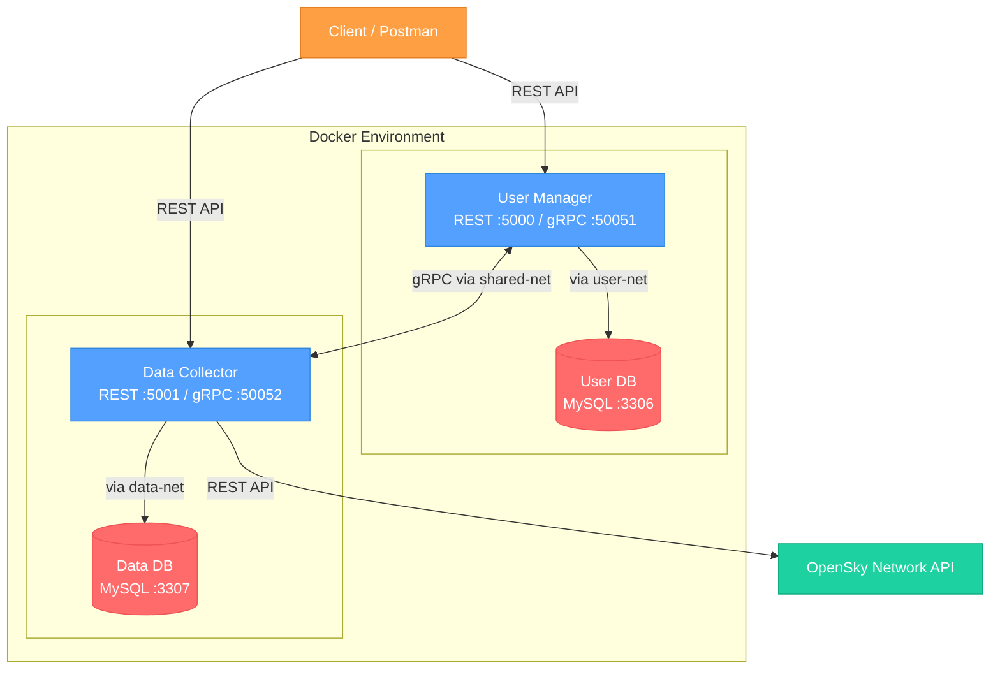

# Distributed Systems and Big Data (DSBD) Project

---

## Descrizione del Progetto

Questo repository ospita l'implementazione di un sistema distribuito containerizzato a microservizi per il monitoraggio del traffico aereo. Il sistema consente di gestire la registrazione e la cancellazione di utenti, nonché il recupero e l’elaborazione di dati su voli aerei da OpenSky Network, fornendo la possibilità agli utenti di inserire aeroporti di interesse e, successivamente, di ottenere diverse informazioni sui dati dei voli aerei che il sistema automaticamente (e ciclicamente) raccoglie dalle API per questi ultimi.

---

## Architettura del Sistema

Il sistema è composto da 4 container Docker gestiti tramite 3 reti distinte per garantire l'isolamento del livello di persistenza e dei servizi.



**Dettagli sulle Reti:**

- Ogni microservizio comunica **solo** con il proprio database dedicato, rispettivamente tramite la rete `user-net` per il servizio user manager e `data-net` per il data collector
- I due microservizi possono comunicare tra loro **solo** tramite gRPC sulla `shared-net`
- I database sono completamente **isolati** e inaccessibili dall'esterno
- Si veda il file **RELAZIONE.pdf** per un maggiore dettaglio sull'architettura

---

## Caratteristiche Tecniche

### 1. Microservizi

- **User Manager**: Gestisce l'intero ciclo di vita degli utenti (registrazione e cancellazione) interagendo con il proprio database dedicato. L'operazione di registrazione implementa rigorosamente la politica "at-most-once". Espone API REST verso i client e un server gRPC interno utilizzato dal Data Collector per verificare l'esistenza degli utenti prima di autorizzare operazioni sugli interessi.
- **Data Collector**: Responsabile della gestione delle sottoscrizioni (interessi) e del monitoraggio. Integra uno scheduler che interroga ciclicamente le API pubbliche di OpenSky Network (tramite client OAuth2) per recuperare voli in partenza e in arrivo, memorizzandoli nel Data DB. Fornisce endpoint REST per l'analisi dei dati, come il recupero dell'ultimo volo registrato e il calcolo della media dei voli in un intervallo temporale.

### 2. Feature di comunicazione

- **At-Most-Once Delivery**: Implementazione di una `Request Cache`, svuotata periodicamente, su database per filtrare richieste duplicate e garantire che ogni registrazione avvenga al massimo una volta.
- **Distributed Transactions**: Adozione di una strategia di coordinamento `"All-or-Nothing"` per la cancellazione: un utente viene rimosso solo se la contestuale rimozione dei suoi interessi sul servizio remoto (via gRPC) ha successo.
- **Retry Policy**: I client gRPC implementano una logica di retry automatico con backoff esponenziale per gestire la resilienza contro errori di rete momentanei.

### 3. Ottimizzazioni

- **Bulk Upsert**: Utilizzo della clausola `ON DUPLICATE KEY UPDATE` di MySQL per l'inserimento o l'aggiornamento massivo ed efficiente di centinaia di record di voli in un'unica transazione.
- **Parallelismo**: Impiego di `ThreadPoolExecutor` nel job di raccolta dati per interrogare le API di OpenSky in parallelo per molteplici aeroporti, riducendo i tempi di attesa, e con utilizzo di un mutex sul token in modo che sia condivido tra i thread (quando valido) ma, alla scadenza, solo uno prenda l'incarico di aggiornalo.
- **Sicurezza**: Crittografia simmetrica `(Fernet)` applicata ai dati sensibili (IBAN) prima della persistenza su DB.

---

## API Reference

Il sistema espone i seguenti endpoint REST principali.

### User Manager (Porta 5000)

| Metodo | Endpoint                | Descrizione                                                                 |
| ------ | ----------------------- | --------------------------------------------------------------------------- |
| GET    | `/health`               | Health check del servizio.                                                  |
| POST   | `/users`                | Registrazione utente.   |
| GET    | `/users`                | Lista di tutti gli utenti registrati.                                       |
| GET    | `/users/{email}`        | Recupero dettagli di un singolo utente.                                     |
| DELETE | `/users/{email}`        | Cancellazione utente con coordinamento gRPC per rimozione interessi remoti. |
| GET    | `/users/verify/{email}` | Verifica rapida esistenza utente (restituisce `exists: true/false`).        |

### Data Collector (Porta 5001)

| Metodo | Endpoint                         | Descrizione                                                                            |
| ------ | -------------------------------- | -------------------------------------------------------------------------------------- |
| GET    | `/health`                        | Health check del servizio (include stato scheduler).                                   |
| POST   | `/interests`                     | Aggiunta di un aeroporto di interesse (verifica esistenza utente via gRPC).            |
| GET    | `/interests/{email}`             | Recupero lista interessi di un utente.                                                 |
| DELETE | `/interests`                     | Rimozione di un interesse specifico (query params: `email`, `airport_icao`).           |
| GET    | `/flights/{airport_icao}`                | Lista voli per aeroporto (filtri: `email`, `type`, `start_date`, `end_date`, `limit`). |
| GET    | `/flights/{airport_icao}/latest`         | Recupero dell'ultimo volo registrato per un dato aeroporto.                            |
| GET    | `/flights/{airport_icao}/average`        | Calcolo della media giornaliera dei voli (query params: `email`, `days`, `type`).      |
| GET    | `/flights/{airport_icao}/stats/airlines` | Top 5 compagnie aeree per traffico sull'aeroporto.                                     |
| POST   | `/collect/manual`                | Trigger manuale per l'esecuzione immediata del job di raccolta dati.                   |
| GET    | `/scheduler/status`              | Stato dello scheduler (job attivi e prossima esecuzione).                              |

---

## Setup e Deploy

### Prerequisiti

- Docker Desktop / Docker Engine
- Docker Compose
- Git
- Client (Postman/cURL)

### Installazione

**1. Clonare il repository**

```bash
git clone https://github.com/RickyV02/DSBD_Project.git
cd DSBD_Project
```

**2. Configurare l'ambiente**

Creare un file `.env` nella root del progetto con la seguente configurazione:

```bash
# Database Configuration
MYSQL_ROOT_PASSWORD=rootpassword
MYSQL_USER=admin
MYSQL_PASSWORD=password
MYSQL_DATABASE_USER=userdb
MYSQL_DATABASE_DATA=datadb

# Porte Esterne (Host)
USER_DB_PORT=3306
DATA_DB_PORT=3307
USER_MANAGER_PORT=5000
DATA_COLLECTOR_PORT=5001

# Configurazione Interna Docker
DB_HOST=user-db
DATA_DB_HOST=data-db
USER_MANAGER_HOST=user-manager
DATA_COLLECTOR_HOST=data-collector
DB_INTERNAL_PORT=3306
USER_MANAGER_GRPC_PORT=50051
DATA_COLLECTOR_GRPC_PORT=50052

# Application Settings
COLLECTION_INTERVAL_HOURS=12
ENCRYPTION_KEY=Vs1DTDJUhzrZUvriY6LDKoOPSHUb6Vx9KRJAgtTxfz0=

# OpenSky Credentials (inserire le proprie credenziali)
CLIENT_ID=
CLIENT_SECRET=
```

**3. Build e Avvio**

```bash
docker compose up --build -d
```

**4. Verifica Stato**

```bash
docker compose ps
```

---

## Testing con Postman

Per testare rapidamente tutte le funzionalità del sistema, è disponibile una collection Postman pre-configurata.

### Come utilizzare la Collection

1. **Importare la collection**: Aprire Postman e importare il file `postman_collection.json` presente nella root del repository.

2. **Configurare le variabili**: La collection utilizza variabili d'ambiente per gli URL base dei servizi e anche per alcune variabili delle API REST implementate, chiaramente è possibile modificarle per avere ulteriori test custom.

3. **Eseguire i test**: La collection include esempi pre-configurati per tutti gli endpoint, organizzati per servizio:

   - **User Manager**: Registrazione, recupero, lista e cancellazione utenti.
   - **Data Collector**: Gestione interessi, query voli e statistiche.

4. **Test di At-Most-Once**: La collection include richieste duplicate con lo stesso `Request-ID` per verificare il corretto funzionamento della politica At-Most-Once.

5. **Test di gestione errori**: Sono presenti casi di test per validare la risposta del sistema a input errati o risorse non trovate.

---

## Struttura del Repository

```
DSBD_Project/
├── data-collector/                 # Microservizio raccolta e gestione dati dei voli aerei
│   ├── app.py                      # Entry point e API REST
│   ├── database.py                 # Configurazione SQLAlchemy
│   ├── Dockerfile
│   ├── grpc_client.py              # Client gRPC verso User Manager
│   ├── grpc_server.py              # Server gRPC
│   ├── models.py                   # Modelli ORM (Interest, Flight)
│   ├── opensky_client.py           # Client OAuth2 per OpenSky
│   ├── requirements.txt
│   └── scheduler.py                # Job di raccolta periodica
│
├── proto/                          # Definizioni Protocol Buffers
│   ├── user_service.proto          # Servizio UserService
│   └── data_collector_service.proto # Servizio DataCollectorService
│
├── user-manager/                   # Microservizio gestione utenti
│   ├── app.py                      # Entry point e API REST
│   ├── database.py                 # Configurazione SQLAlchemy
│   ├── Dockerfile
│   ├── grpc_client.py              # Client gRPC verso Data Collector
│   ├── grpc_server.py              # Server gRPC
│   ├── models.py                   # Modelli ORM (User, RequestCache)
│   └── requirements.txt
│
├── .gitignore
├── README.md
├── RELAZIONE.pdf                   # Documentazione tecnica completa
├── docker-compose.yml              # Orchestrazione container
├── postman_collection.json         # Collection per testing API
```

---

## Licenza

Progetto accademico sviluppato per il corso di Distributed Systems and Big Data (LM-32), Università degli Studi di Catania.
