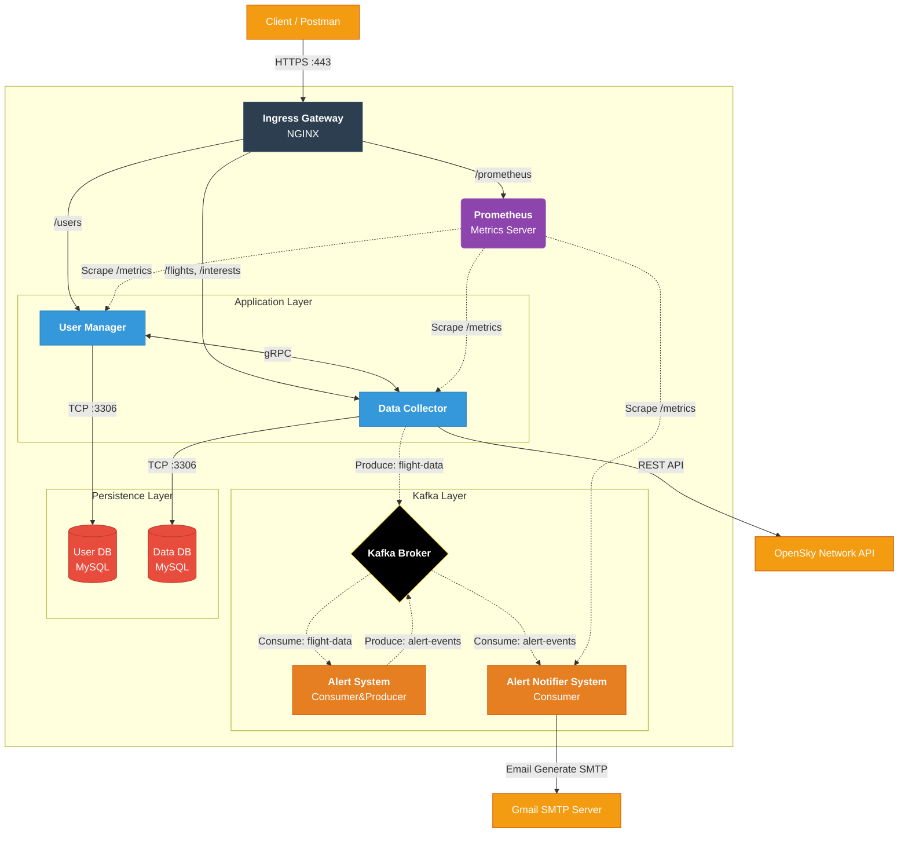
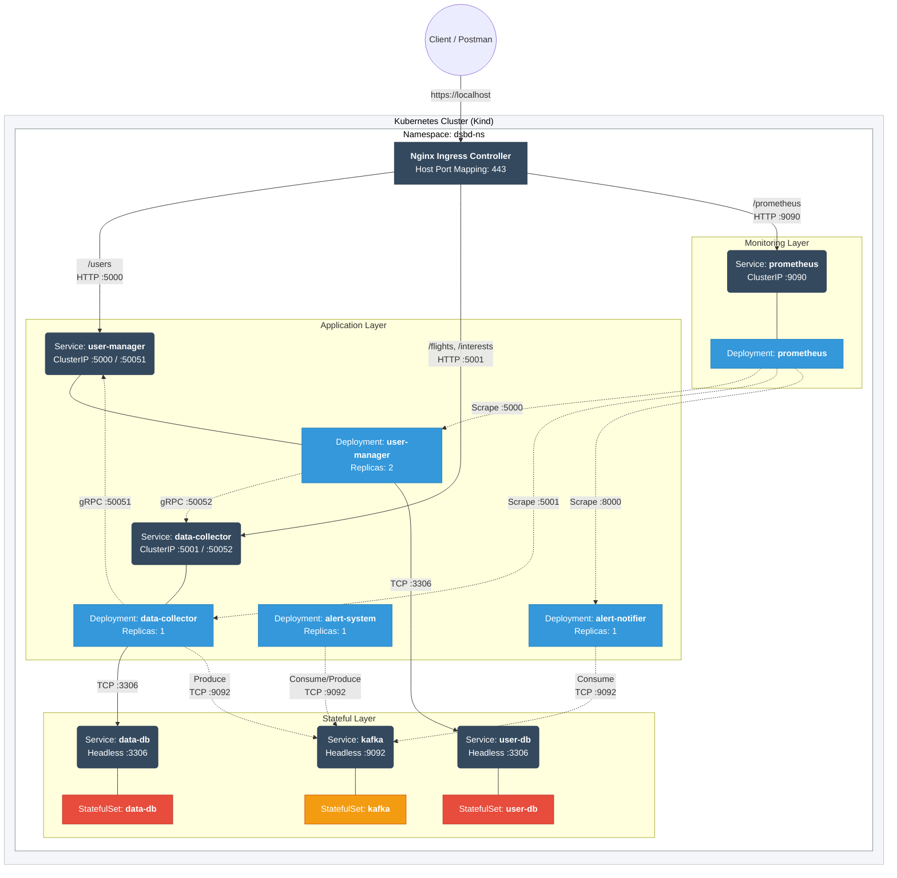

# Distributed Systems and Big Data (DSBD) Project (Homework 3 Version)

---

## Descrizione del Progetto

Questo repository ospita l'ulteriore evoluzione di un sistema distribuito a microservizi per il monitoraggio del traffico aereo, estendendo le funzionalità sviluppate nei precedenti Homework (disponibili nei branch `homework-1` e `homework-2`).
L'obiettivo principale di questa iterazione è l'introduzione di un meccanismo di **White-box Monitoring** basato su **Prometheus** e il deployment dell'intera infrastruttura su piattaforma **Kubernetes** (utilizzando Kind per l'ambiente locale).

Ogni microservizio soggetto a monitoraggio espone metriche specifiche (Counter e Gauge) arricchite con label che identificano il servizio e il nodo Kubernetes ospitante, permettendo un'analisi dettagliata delle performance e dello stato del sistema.

---

## Architettura del Sistema

L'architettura è stata adattata per l'orchestrazione via Kubernetes, introducendo concetti come Namespace, Deployment, Ingress, StatefulSet e Services. Di seguito sono presentate la vista logica dei componenti e la vista di deployment su Kubernetes.

### Vista Logica

Il sistema integra ora il server Prometheus che effettua lo scraping periodico delle metriche esposte dai servizi.



### Vista di Deployment (Kubernetes)

Il deployment sfrutta un cluster **Kind** locale, simulando un ambiente di produzione con **Namespace** dedicato, **StatefulSet** per i database e **Ingress** per l'accesso esterno.



---

## Configurazione e Sicurezza

Prima di procedere con il deploy del sistema, è **necessario** creare manualmente un file `secrets.yaml` nella cartella `k8s/`. Questo file non è incluso nel repository per motivi di sicurezza.

### Template `k8s/secrets.yaml`

Creare il file utilizzando il seguente template e sostituire i valori con le proprie stringhe codificate in **Base64**:

```yaml
apiVersion: v1
kind: Secret
metadata:
  name: app-secrets
  namespace: dsbd-ns
type: Opaque
data:
  # Credenziali Database (Base64)
  MYSQL_ROOT_PASSWORD: "..."
  MYSQL_USER: "..."
  MYSQL_PASSWORD: "..."

  # Credenziali OpenSky (Base64)
  CLIENT_ID: "..."
  CLIENT_SECRET: "..."

  # Sicurezza Applicativa (Base64)
  ENCRYPTION_KEY: "..."

  # Server SMTP Email (Base64)
  SMTP_USER: "..."
  SMTP_PASSWORD: "..."
```

---

## Istruzioni per l'Avvio

Il progetto include script di automazione per semplificare il ciclo di vita del cluster Kind e dell'applicazione.

### Prerequisiti

- Docker Desktop
- Kind
- Kubectl

### Setup e Avvio (Script Automatico)

Prima di eseguire gli script per la prima volta, è necessario assegnare i permessi di esecuzione a tutti i file `.sh` presenti nella root tramite il comando:
```bash
chmod +x *.sh
```

Successivamente, per creare il cluster, costruire e caricare su kind le immagini Docker ed applicare i manifest, è sufficiente eseguire lo script `start.sh`:
```bash
./start.sh
```

### Script Helper

- `./stop.sh`: Mette in pausa i nodi del cluster (equivalente a `docker stop`), preservando lo stato dei dati.
- `./restart.sh`: Riavvia i nodi precedentemente arrestati.
- `./clear.sh`: **Elimina** definitivamente il cluster e tutti i dati associati.

### ⚠️ Note sulle Performance e Risorse

L'ambiente Kubernetes locale (Kind) su Docker/WSL può richiedere tempi di avvio rilevanti.
Si precisa che il tempo di **avvio** riportato di seguito include: sia i minuti necessari all'esecuzione dello script `start.sh` (~2-3 minuti), sia i minuti effettivi impiegati dai Pod per avviarsi.

| Operazione                   | Tempo Stimato     | Nota                                                                                                                                                                                                          |
| ---------------------------- | ----------------- | ------------------------------------------------------------------------------------------------------------------------------------------------------------------------------------------------------------- |
| **Primo Avvio (Cold Start)** | **~12-15 minuti** | Il tempo è dovuto principalmente alla creazione dei nodi del cluster e dei volumi persistenti MySQL, nonché all'overhead di I/O su filesystem virtualizzati e alle risorse/carico di lavoro del sistema Host. |
| **Riavvio (Restart)**        | **~2-3 minuti**   | I riavvii successivi sono molto più rapidi in quanto i volumi sono già inizializzati.                                                                                                                         |

> **Nota di Configurazione**: Nei manifest Kubernetes, le sezioni `limits` (CPU/Memory limits) sono state predisposte ma **commentate**. Questa è una scelta progettuale per garantire che i Pod non vengano terminati o rallentati eccessivamente in ambienti di sviluppo con risorse limitate (es. laptop standard con 2 Worker Nodes), dove i picchi di CPU all'avvio sono frequenti. Anche le **Probe** (Liveness/Readiness) sono state configurate con soglie molto elevate e tolleranti per evitare crash loop durante le fasi di inizializzazione lenta. Si lasciano indicate, invece, all'interno dei manifest, le `requests` (risorse minime garantite). Chiaramente in fase di staging/prod, tali valori vanno non solo configurati, ma anche adattati in maniera opportuna.

---

## White-box Monitoring (Prometheus Metrics)

Di seguito sono riportate le metriche custom esposte dai microservizi tramite l' endpoint `/metrics`. Le metriche includono label per identificare il nodo fisico Kubernetes di esecuzione (non il pod effimero, anche se quest'ultimo verrà anch'esso inserito da Prometheus per completezza) e il servizio che le ha prodotte.

### 1. User Manager Service

- **`http_requests_total`** (Counter)
  - _Descrizione_: Conteggio totale delle richieste HTTP ricevute.
  - _Labels_: `method`, `endpoint`, `status`, `service`, `node`.
- **`active_users_total`** (Gauge)
  - _Descrizione_: Numero totale di utenti attualmente registrati nel sistema. Aggiornato periodicamente (10s) tramite query al DB da un thread dedicato, in modo tale da restare consistente anche in fase di replicazione del microservizio.
  - _Labels_: `service`, `node`.
- **`cache_cleanup_duration_seconds`** (Gauge)
  - _Descrizione_: Tempo impiegato per la pulizia della cache delle richieste idempotenti "scadute".
  - _Labels_: `service`, `node`.
- **`cache_cleaned_entries_total`** (Counter)
  - _Descrizione_: Numero totale di elementi rimossi dalla cache.
  - _Labels_: `service`, `node`.

### 2. Data Collector Service

- **`opensky_api_calls_total`** (Counter)
  - _Descrizione_: Numero totale di chiamate verso l'API di OpenSky Network.
  - _Labels_: `service`, `node`, `status` (attempt, success, failure).
- **`http_requests_total`** (Counter)
  - _Descrizione_: Conteggio totale delle richieste HTTP ricevute.
  - _Labels_: `method`, `endpoint`, `status`, `service`, `node`.
- **`flight_data_processing_seconds`** (Gauge)
  - _Descrizione_: Tempo impiegato per recuperare ed elaborare i dati dei voli (fetch + salvataggio DB + invio messaggi Kafka) durante l'ultimo ciclo di raccolta.
  - _Labels_: `service`, `node`.

### 3. Alert Notifier System

- **`emails_sent_total`** (Counter)
  - _Descrizione_: Totale email di alert inviate.
  - _Labels_: `service`, `node`, `status` (success/failure).
- **`last_email_sent_duration_seconds`** (Gauge)
  - _Descrizione_: Tempo impiegato per l'invio dell'ultima email tramite server SMTP.
  - _Labels_: `service`, `node`.

---

## API Reference

L'accesso a tutti i servizi avviene tramite **Ingress Controller (Nginx)** esposto in **HTTPS** sulla porta **443** (`localhost`).
Il certificato è auto-firmato, quindi potrebbe essere necessario ignorare gli avvisi di sicurezza del browser o usare `-k` con curl.
**NOTA**: Gli endpoint `/health` dei microservizi, precedentemente raggiungibili tramite endpoint pubblici (`/health/users`,`/health/data`), ora non sono più esposti all'esterno del cluster tramite Ingress per motivi di sicurezza, ma sono sempre attivi sui Pod per le Probe di Kubernetes. Ovviamente restano raggiungibili dall'esterno se si vuole eseguire il sistema tramite Docker Compose.
Di seguito l'elenco degli endpoint raggiungibili del sistema, divisi per servizio.

### User Manager

| Metodo     | Endpoint Esterno        | Descrizione                                                                                                                                                                                      | Parametri / Body                                                                           |
| ---------- | ----------------------- | ------------------------------------------------------------------------------------------------------------------------------------------------------------------------------------------------ | ------------------------------------------------------------------------------------------ |
| **POST**   | `/users`                | Registrazione nuovo utente.                                                                                                                                                                      | **Body:** `nome`, `cognome`, `email`, `codice_fiscale`, `iban` (Tutti obbligatori). |
| **GET**    | `/users`                | Lista di tutti gli utenti registrati.                                                                                                                                                            | -                                                                                          |
| **GET**    | `/users/{email}`        | Dettagli di un singolo utente.                                                                                                                                                                   | -                                                                                          |
| **GET**    | `/users/verify/{email}` | Verifica rapida esistenza utente (restituisce `{ "exists": true/false`).                                                                                                                                                              | -                                           |
| **DELETE** | `/users/{email}`        | Cancellazione utente. Esegue una **Transazione Distribuita**: contatta prima il Data Collector via gRPC per rimuovere gli interessi e, solo in caso di successo, elimina l'utente dal DB locale. | -                                                                                          |

---

### Data Collector

| Metodo     | Endpoint Esterno                 | Descrizione                                                                                                                                                     | Parametri / Body                                                                                           |
| ---------- | -------------------------------- | --------------------------------------------------------------------------------------------------------------------------------------------------------------- | ---------------------------------------------------------------------------------------------------------- |
| **POST**   | `/interests`                     | Aggiunta interesse per un aeroporto. Verifica l'esistenza dell'utente via gRPC prima di salvare. Se è un nuovo aeroporto, triggera una raccolta dati immediata. | **Body:** `email` (req), `airport_icao` (req), `high_value` (opt), `low_value` (opt).               |
| **GET**    | `/interests/{email}`             | Lista interessi attivi per un utente.                                                                                                                           | -                                                                                                          |
| **DELETE** | `/interests`                     | Rimozione di un interesse specifico.                                                                                                                            | **Query Params:** `email`, `airport_icao`.                                                                 |
| **GET**    | `/flights/{icao}`                | Storico voli salvati per un aeroporto.                                                                                                                          | **Query Params:** `email` (req), `type` (departure/arrival), `start_date`, `end_date`, `limit` (max 1000). |
| **GET**    | `/flights/{icao}/latest`         | Ultimo volo registrato (arrivo o partenza).                                                                                                                     | **Query Params:** `email`, `type` (opt).                                                             |
| **GET**    | `/flights/{icao}/average`        | Statistiche: media giornaliera dei voli.                                                                                                                        | **Query Params:** `email` (req), `days`, `type`.                                               |
| **GET**    | `/flights/{icao}/stats/airlines` | Top 5 compagnie aeree per traffico sull'aeroporto.                                                                                                              | **Query Params:** `email` (req).                                                                           |
| **POST**   | `/collect/manual`                | Trigger manuale per l'esecuzione immediata del job di raccolta dati (threading asincrono).                                                                      | -                                                                                                          |
| **GET**    | `/scheduler/status`              | Stato dello scheduler interno (job attivi e next run time).                                                                                                     | -                                                                                                          |

---

### Prometheus

Il sistema espone le metriche sulla dashboard di Prometheus.

| Servizio           | Endpoint Esterno (Ingress)      | Descrizione                                                                   |
| ------------------ | ---------------- | ------------------------------- |
| **Prometheus UI**  | `https://localhost/prometheus/` | Dashboard di Prometheus per query PromQL.|

> **Nota sulle Configurazioni**: Nel repository sono presenti due file di configurazione per Prometheus.
> - **`k8s/prometheus-config.yaml`**: Utilizzato nel deployment Kubernetes, sfrutta il **Service Discovery** dinamico per individuare i Pod tramite le API del cluster.
> - **`prometheus.yml` (Root)**: Utilizzato esclusivamente per l'avvio tramite Docker Compose, basato su una configurazione statica (`static_configs`) per l'ambiente di sviluppo legacy.

---

### Setup e Deploy (sezione utile principalmente per Docker Compose)

**1. Clonare il repository**

```bash
git clone https://github.com/RickyV02/DSBD_Project.git
cd DSBD_Project
```

**2. Configurare l'ambiente**

Creare un file `.env` nella root con le seguenti configurazioni (incluso SMTP per le notifiche):
**NOTA**: Questo file non è necessario se si vuole eseguire il sistema su k8s ed è stato già creato il file `secrets.yaml` nella cartella `k8s/`. Resta necessario, tuttavia, qualora si volesse testare il sistema tramite Docker Compose.

```bash
# Database Configuration
MYSQL_ROOT_PASSWORD=rootpassword
MYSQL_USER=admin
MYSQL_PASSWORD=password
MYSQL_DATABASE_USER=userdb
MYSQL_DATABASE_DATA=datadb

# Porte Esterne (Host)
USER_DB_PORT=3306
DATA_DB_PORT=3307
USER_MANAGER_PORT=5000 # Questa porta NON è esposta, la userà Nginx
DATA_COLLECTOR_PORT=5001 # # Questa porta NON è esposta, la userà Nginx

# Configurazione Interna e gRPC
DB_INTERNAL_PORT=3306
USER_MANAGER_GRPC_PORT=50051
DATA_COLLECTOR_GRPC_PORT=50052

# Hostnames (Docker Network)
DB_HOST=user-db
DATA_DB_HOST=data-db
USER_MANAGER_HOST=user-manager
DATA_COLLECTOR_HOST=data-collector

# Application Settings
COLLECTION_INTERVAL_HOURS=12
# Generare una chiave Fernet valida (es. via python cryptography)
ENCRYPTION_KEY=Vs1DTDJUhzrZUvriY6LDKoOPSHUb6Vx9KRJAgtTxfz0=

# OpenSky Credentials
CLIENT_ID=your_opensky_client_id
CLIENT_SECRET=your_opensky_client_secret

# Kafka
KAFKA_BOOTSTRAP_SERVERS=kafka:9092

# Email Notification Config
SMTP_SERVER=smtp.gmail.com
SMTP_PORT=465
SMTP_USER=your_email@gmail.com
SMTP_PASSWORD=your_app_password
SENDER_EMAIL=your_email@gmail.com
```

**3. Build e Avvio**

```bash
docker compose up --build -d
```

**4. Verifica Stato**

```bash
docker compose ps
```

---

## Testing con Postman

Per testare rapidamente tutte le funzionalità del sistema, è disponibile una collection Postman pre-configurata e aggiornata.

### Come utilizzare la Collection

1. **Importare la collection**: Aprire Postman e importare il file `postman_collection.json` presente nella root del repository.

2. **Configurare le variabili**: La collection utilizza variabili d'ambiente per gli URL dei servizi e anche per alcune variabili delle API REST implementate, chiaramente è possibile modificarle per avere ulteriori test custom. Inserire una mail personale per ricevere gli alert di Kafka.

3. **Eseguire i test**: La collection include esempi pre-configurati per tutti gli endpoint, organizzati per servizio.

> **Nota Importante per HTTPS**: Poiché stiamo usando certificati self-signed su Kubernetes locale, disabilitare l'opzione **"SSL certificate verification"** nelle impostazioni generali di Postman (`Settings -> General`).

---

## Struttura del Repository

```
dsbd-project/
│
├── alert-notifier-system/      # Codice sorgente Alert Notifier
├── alert-system/               # Codice sorgente Alert System
├── data-collector/             # Codice sorgente Data Collector
├── k8s/                        # Manifest di Deployment Kubernetes
├── nginx/                      # API Gateway (per uso tramite Docker Compose)
├── proto/                      # File .proto per gRPC
├── user-manager/               # Codice sorgente User Manager
├── .dockerignore
├── .gitignore
├── start.sh, stop.sh, ...      # Scripts per avvio, stop, restart e cancellazione del cluster
├── docker-compose.yml
├── postman_collection.json
├── prometheus.yml              # File di configurazione di Prometheus (per uso tramite Docker Compose)
├── README.md                   
└── RELAZIONE.pdf 
```

---

## Licenza

Progetto accademico sviluppato per il corso di Distributed Systems and Big Data (LM-32), Università degli Studi di Catania.
