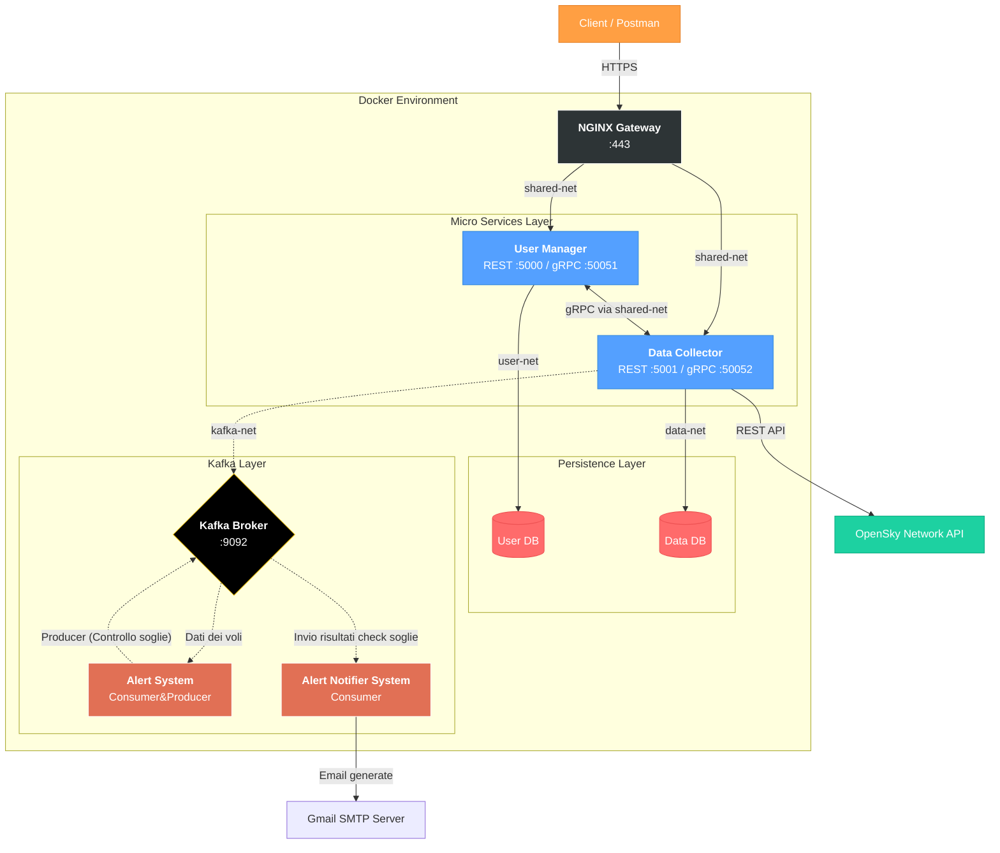

# Distributed Systems and Big Data (DSBD) Project (Homework 2 Version)

---

## Descrizione del Progetto

Questo repository ospita l'evoluzione di un sistema distribuito a microservizi per il monitoraggio del traffico aereo. Rispetto alla versione precedente (disponibile nel branch `homework-1`), l'architettura è stata estesa per supportare l'utilizzo di: Broker Kafka per l'invio di messaggi verso gli utenti registrati, API Gateway tramite Nginx e il pattern Circuit Breaker per proteggere le chiamate verso OpenSky Network. Per eventuali chiarimenti, controllare il branch `homework-1`.

Il sistema permette ora non solo di raccogliere dati da OpenSky Network, ma di monitorare soglie personalizzate di traffico aereo (`high_value`, `low_value`) e inviare notifiche via email in tempo reale grazie a una pipeline di elaborazione basata su eventi.

---

## Architettura del Sistema

Il sistema è composto da 8 container Docker orchestrati tramite 4 reti distinte, garantendo il massimo livello di isolamento e sicurezza.



### Topologia di Rete

- **shared-net**: Rete di comunicazione per gRPC (tra microservizi) e HTTPS (da Nginx ai microservizi).
- **kafka-net**: Rete dedicata al messaging di Kafka.
- **user-net / data-net**: Reti private per l'isolamento dei Database.

---

## Nuove Caratteristiche Tecniche (HW2)

### 1. API Gateway & Sicurezza (Nginx)

Tutto il traffico in ingresso è ora gestito da **Nginx**, configurato come Reverse Proxy.

- **Utilizzo SSL**: Gestisce certificati (self-signed) e crittografia, liberando i microservizi da questo onere e garantendo connessioni cifrate e sicure.
- **Isolamento**: I backend non espongono più porte dirette all'host, ma sono raggiungibili solo attraverso il gateway.

### 2. Messaging (Kafka)
L'introduzione di **Apache Kafka** ha introdotto il seguente schema di messaging:

- **Data Collector (Producer)**: Pubblica i dati aggiornati sul topic `to-alert-system`.
- **Alert System (Producer&Consumer)**: Analizza i dati rispetto alle soglie utente (`high/low value`) e genera eventi di notifica sul topic `to-notifier`.
- **Alert Notifier (Consumer)**: Gestisce l'invio fisico delle email tramite server SMTP.

### 3. Pattern Circuit Breaker

Le chiamate verso l'API esterna OpenSky sono protette da un *Circuit Breaker*.

- Se OpenSky è irraggiungibile o lento, il circuito si apre per evitare di bloccare i thread dello scheduler.
- Il sistema va in Graceful Degradation, saltando temporaneamente gli aggiornamenti senza crashare.

---

## API Reference

L'accesso avviene ora esclusivamente tramite **HTTPS sulla porta 443** (localhost).

### User Manager

| Metodo | Endpoint                | Descrizione                                                                 |
| ------ | ----------------------- | --------------------------------------------------------------------------- |
| GET    | `/health`               | Health check del servizio.                                                  |
| POST   | `/users`                | Registrazione utente.   |
| GET    | `/users`                | Lista di tutti gli utenti registrati.                                       |
| GET    | `/users/{email}`        | Recupero dettagli di un singolo utente.                                     |
| DELETE | `/users/{email}`        | Cancellazione utente con coordinamento gRPC per rimozione interessi remoti. |
| GET    | `/users/verify/{email}` | Verifica rapida esistenza utente (restituisce `exists: true/false`).        |

### Data Collector

| Metodo | Endpoint                         | Descrizione                                                                            |
| ------ | -------------------------------- | -------------------------------------------------------------------------------------- |
| GET    | `/health`                        | Health check del servizio (include stato scheduler).                                   |
| POST   | `/interests`                     | Aggiunta di un aeroporto di interesse (verifica esistenza utente via gRPC), è possibile specificare i parametri OPZIONALI (`high_value`, `low_value`)|
| GET    | `/interests/{email}`             | Recupero lista interessi di un utente.                                                 |
| DELETE | `/interests`                     | Rimozione di un interesse specifico (query params: `email`, `airport_icao`).           |
| GET    | `/flights/{airport_icao}`                | Lista voli per aeroporto (filtri: `email`, `type`, `start_date`, `end_date`, `limit`). |
| GET    | `/flights/{airport_icao}/latest`         | Recupero dell'ultimo volo registrato per un dato aeroporto.                            |
| GET    | `/flights/{airport_icao}/average`        | Calcolo della media giornaliera dei voli (query params: `email`, `days`, `type`).      |
| GET    | `/flights/{airport_icao}/stats/airlines` | Top 5 compagnie aeree per traffico sull'aeroporto.                                     |
| POST   | `/collect/manual`                | Trigger manuale per l'esecuzione immediata del job di raccolta dati.                   |
| GET    | `/scheduler/status`              | Stato dello scheduler (job attivi e prossima esecuzione).                              |

---

### Setup e Deploy

**1. Clonare il repository**

```bash
git clone https://github.com/RickyV02/DSBD_Project.git
cd DSBD_Project
```

**2. Configurare l'ambiente**

Creare un file `.env` nella root con le seguenti configurazioni (incluso SMTP per le notifiche):

```bash
# Database Configuration
MYSQL_ROOT_PASSWORD=rootpassword
MYSQL_USER=admin
MYSQL_PASSWORD=password
MYSQL_DATABASE_USER=userdb
MYSQL_DATABASE_DATA=datadb

# Porte Esterne (Host)
USER_DB_PORT=3306
DATA_DB_PORT=3307
USER_MANAGER_PORT=5000 # Questa porta NON è esposta, la userà Nginx
DATA_COLLECTOR_PORT=5001 # # Questa porta NON è esposta, la userà Nginx

# Configurazione Interna e gRPC
DB_INTERNAL_PORT=3306
USER_MANAGER_GRPC_PORT=50051
DATA_COLLECTOR_GRPC_PORT=50052

# Hostnames (Docker Network)
DB_HOST=user-db
DATA_DB_HOST=data-db
USER_MANAGER_HOST=user-manager
DATA_COLLECTOR_HOST=data-collector

# Application Settings
COLLECTION_INTERVAL_HOURS=12
# Generare una chiave Fernet valida (es. via python cryptography)
ENCRYPTION_KEY=Vs1DTDJUhzrZUvriY6LDKoOPSHUb6Vx9KRJAgtTxfz0=

# OpenSky Credentials
CLIENT_ID=your_opensky_client_id
CLIENT_SECRET=your_opensky_client_secret

# Kafka
KAFKA_BOOTSTRAP_SERVERS=kafka:9092

# Email Notification Config
SMTP_SERVER=smtp.gmail.com
SMTP_PORT=465
SMTP_USER=your_email@gmail.com
SMTP_PASSWORD=your_app_password
SENDER_EMAIL=your_email@gmail.com
```

**3. Build e Avvio**

```bash
docker compose up --build -d
```

**4. Verifica Stato**

```bash
docker compose ps
```

---

## Testing con Postman

Per testare rapidamente tutte le funzionalità del sistema, è disponibile una collection Postman pre-configurata e aggiornata.

### Come utilizzare la Collection

1. **Importare la collection**: Aprire Postman e importare il file `postman_collection.json` presente nella root del repository.

2. **Configurare le variabili**: La collection utilizza variabili d'ambiente per gli URL dei servizi e anche per alcune variabili delle API REST implementate, chiaramente è possibile modificarle per avere ulteriori test custom.

3. **Eseguire i test**: La collection include esempi pre-configurati per tutti gli endpoint, organizzati per servizio.

---

> **⚠️ Nota sul Primo Avvio (Cold Start):**
> Alla prima esecuzione, Kafka e MySQL potrebbero impiegare circa 20-30 secondi per inizializzare i volumi e i topic interni. Se i container Python si riavviano inizialmente ("restarting"), è un comportamento normale di auto-guarigione. Attendere che Nginx e i servizi siano stabili prima di lanciare richieste tramite Postman.

>**⚠️ Nota sulle API di OpenSky Network:**
>Durante lo sviluppo di questa seconda iterazione, sono emerse criticità durante la raccolta dei dati tramite le API di OpenSky Network; in particolare, gli endpoint utilizzati all'interno del file `opensky_client.py`, ossia `GET /flights/departure` e `GET /flights/arrival`, hanno avuto bisogno di un fix sulla finestra temporale dei dati dei voli richiesti. Precisamente, nella precedente iterazione venivano raccolte ogni 12 ore i dati delle ultime 24, mentre adesso la finestra di raccolta è stata ridotta a 12 ore, TUTTAVIA potrebbe essere necessario ridurla anche ad un valore di 6 ore. Sebbene al momento della scrittura di questa nota il problema dovrebbe essersi risolto, viene lasciato il valore di 12 ore per safety del funzionamento del sistema.
---

## Struttura del Repository

```
DSBD_Project/
│
├── alert-notifier-system/      # Consumer per invio notifiche Email
│   ├── Dockerfile
│   ├── app.py                  # Kafka Consumer -> SMTP Client (Gmail)
│   └── requirements.txt
│
├── alert-system/               
│   ├── Dockerfile
│   ├── app.py                  # Kafka Consumer (Voli) -> Business Logic -> Kafka Producer (Notifiche)
│   └── requirements.txt
│
├── data-collector/             # Microservizio raccolta dati (Esteso)
│   ├── Dockerfile
│   ├── app.py                  # API REST Flask [AGGIORNATO]
│   ├── circuit_breaker.py      # Implementazione pattern Circuit Breaker
│   ├── database.py             # Configurazione SQLAlchemy
│   ├── grpc_client.py          # Client gRPC (verso User Manager)
│   ├── grpc_server.py          # Server gRPC (Ricezione comandi di cancellazione)
│   ├── models.py               # ORM Models (UserInterest, FlightData)
│   ├── opensky_client.py       # [AGGIORNATO] Client API OpenSky protetto da Circuit Breaker
│   ├── requirements.txt
│   └── scheduler.py            # [AGGIORNATO] Job periodico APScheduler + Kafka Producer
│
├── nginx/                      # API Gateway
│   ├── ssl/                    # Certificati auto-firmati per HTTPS (esempi auto-generati)
│   │   ├── nginx-selfsigned.crt
│   │   └── nginx-selfsigned.key
│   └── nginx.conf              # Configurazione Reverse Proxy e Load Balancing
│
├── proto/                      
│   ├── data_collector_service.proto
│   └── user_service.proto
│
├── user-manager/               # Microservizio gestione utenti
│   ├── Dockerfile
│   ├── app.py                  # API REST Flask [AGGIORNATO per leggere l'indirizzo IP del client forwardato dal Gateway]
│   ├── database.py             # Configurazione SQLAlchemy
│   ├── grpc_client.py          # Client gRPC (verso Data Collector)
│   ├── grpc_server.py          # Server gRPC (Verifica Utenti)
│   ├── models.py               # ORM Models (User, RequestCache per At-Most-Once)
│   └── requirements.txt
│
├── .gitignore
├── docker-compose.yml          
├── postman_collection.json     # [AGGIORNATO] Suite di test completa per tutti gli endpoint
├── README.md                   
└── RELAZIONE.pdf               
```
---

## Licenza

Progetto accademico sviluppato per il corso di Distributed Systems and Big Data (LM-32), Università degli Studi di Catania.
